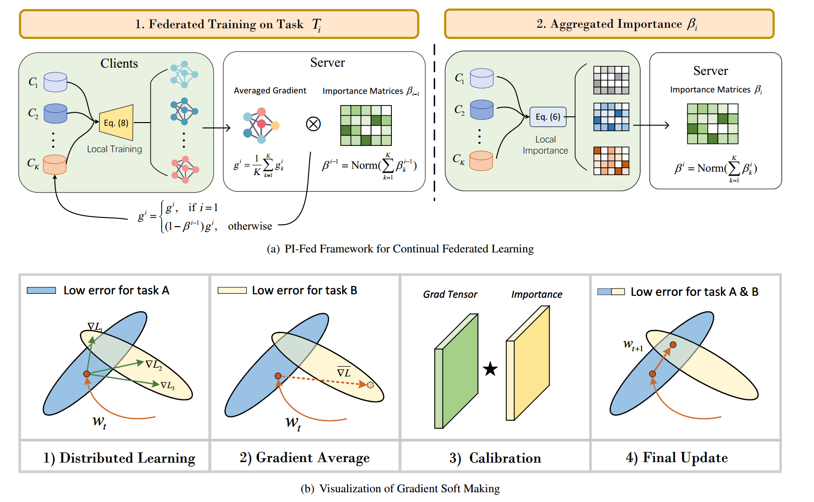

# PI-Fed
**2024/08/07:** Repo has been transferred to [ECNU-ICALK/MELO](https://github.com/ECNU-ICALK/PI-Fed (Organization Account) 🔔

PI-Fed: Continual Federated Learning with Parameter-Level Importance Aggregation
This repo contains the source code of our proposed PI-FED, a federated learning framework, which supports task-incremental learning on private datasets through iterative server-client communications. 
Compared with 3 classic federated learning methods [[FedAvg, FedNova and SCAFFOLD](https://github.com/rruisong/pytorch_federated_learning)], PI-Fed demonstrates significantly better performance on continual FL benchmarks.

## Introduction
Due to the catastrophic forgetting feature of vanilla network optimizers, prior federated learning approaches are restricted to single task learning and typically assume that data from all nodes are simultaneously available during training, which are impractical in most real-world scenarios. 
To overcome these limitations, we propose a continual federated learning framework with parameter-level importance aggregation PI-Fed, 
which supports task-incremental learning on private datasets through iterative server-client communications.



## Experiments
Different FL methods (PI-Fed, FedAvg, FedNova and SCAFFOLD) could be specified with
```yaml
# PI-Fed/conf/config.yaml
fed:
  alg:  PI_Fed # PI_Fed, FedAvg, FedNova, SCAFFOLD
```

Experiments can be reproduced by running

```shell
python3 main.py appr=default seq=<seq> 
```

with specifying `<seq>` for a dataset you want to run.

For `<seq>`, you can choose one from the following datasets.

- `cifar100_10` for **C-10** (CIFAR100 with 10 tasks)
- `cifar100_20` for **C-20**
- `tinyimagenet_10` for **T-10** (TinyImageNet with 10 tasks)
- `tinyimagenet_20` for **T-20**
- `fceleba_10` for **FC-10** (Federated CelebA with 10 tasks)
- `fceleba_20` for **FC-20**
- `femnist_10` for **FE-10** (Federated EMNIST with 10 tasks)
- `femnist_20` for **FE-20**

## Datasets Preparation

We use 4 datasets in the paper. To reproduce the results, some of these datasets need to be prepared manually.

### CIFAR100-based (**C-10** and **C-20**)

You do not need do anything for these datasets as they will be automatically downloaded.

### TinyImageNet-based (**T-10** and **T-20**)

You can download the datasets from [the official site](https://image-net.org/).

1. Download the Tiny ImageNet file.
2. Extract the file, and place them as follows.

<pre>
data/tiny-imagenet-200/
|- train/
|  |- n01443537/
|  |- n01629819/
|  +- ...
+- val/
   |- val_annotations.txt
   +- images/
      |- val_0.JPEG
      |- val_1.JPEG
      +- ...
</pre>

3. Run `prep_tinyimagenet.py` to reorganise files so that `torchvision.datasets.ImageFolder` can read them.
4. Make sure you see the structure as follows.

<pre>
data/tiny-imagenet-200/
|- test/
|  |- n01443537/
|  |- n01629819/
|  +- ...
|- train/
|  |- n01443537/
|  |- n01629819/
|  +- ...
+- val/
   +- # These files are not used any more. 
</pre>


### Federated CelebA-based (**FC-10** and **FC-20**)

1. Follow [the instruction](https://github.com/TalwalkarLab/leaf/tree/master/data/celeba) to create data.
2. Place the raw images under `data/fceleba/raw/img_align_celeba/`.
3. Make sure you see the structure as follows.

<pre>
data/fceleba/
|- iid/
|  |- test/
|  |  +- all_data_iid_01_0_keep_5_test_9.json
|  +- train/ 
|     +- all_data_iid_01_0_keep_5_train_9.json
+- raw/
   +- img_align_celeba/
      |- 000001.jpg
      |- 000002.jpg
      +- ...
</pre>

<pre>
./preprocess.sh -s iid --sf 1.0 -k 5 -t sample --iu 0.01
</pre>
### Federated EMNIST-based (**FE-10** and **FE-20**)

1. Follow [the instruction](https://github.com/TalwalkarLab/leaf/tree/master/data/femnist) to create data.
2. Place the raw images under `data/femnist/raw/train/` and `data/femnist/raw/test/`.
3. Make sure you see the structure as follows.

<pre>
data/femnist/
+- raw/
   |- test
   |  |- all_data_0_iid_01_0_keep_0_test_9.json
   |  |- ...
   |  +- all_data_34_iid_01_0_keep_0_test_9.json
   +- train
      |- all_data_0_iid_01_0_keep_0_train_9.json
      |- ...
      +- all_data_34_iid_01_0_keep_0_train_9.json
</pre>
<pre>
./preprocess.sh -s iid --sf 1.0 -k 0 -t sample
</pre>


